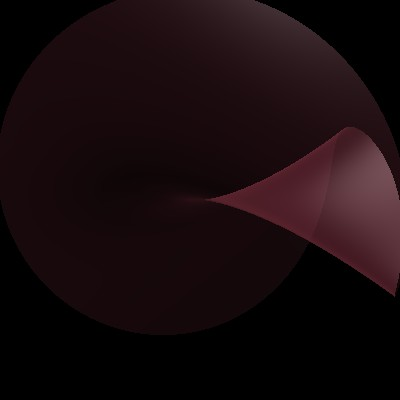
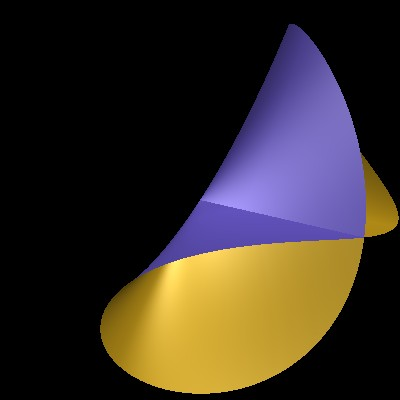

# Some demonstrations for algebraic surfaces


Better documentation will be written later.

There are currently two scripts here:

## Projections of surfaces, and cusps of the branch curve

 This script demonstrates how **generic projections** of smooth
  surfaces from the projective space P^3 give **cusp points** on a
  branch curve (Arnold et al [[(4)]] call this singularity a
  "Whitney pleat", paragraph 1.6, page 14 )

# Pinch points of algebraic surfaces

This script visualizes the pinch point of an algebraic surface
(which is locally formally isomorphic to the Whitney umbrella surface)([Wikipedia: Pinch point][1], [Wikipedia:Whitney umbrella][2];
 Griffiths and Harris, Chapter 4, paragraph 6,  "Ordinary Singularities of Surfaces", [[(3)]]; Arnold et al [[(4)]]-- Part I, paragraph 1, page 24)

## References
 [1]: https://en.wikipedia.org/wiki/Pinch_point_(mathematics)
 [2]: https://en.wikipedia.org/wiki/Whitney_umbrella

 <a id="3">[3]</a> 
 Phillip Griffiths, Joseph Harris, "Principles of Algebraic Geometry", <br>
 Chapter 4, paragraph 6,  "Ordinary Singularities of Surfaces",  <br>
 page 617 (2011 ed.) --  <br>
 point of view of algebraic geometry;

 <a id="4">[4]</a> 
 Vladimir Arnold et al,  <br>
 Singularities of Differ entiable Maps, Volume 1, <br>
 Classification of Critical Points, Caustics and Wave Fronts, 2012,  <br>
 point of view of Singularity theory.

The scripts are written in the [*surf* programming language](https://surf.sourceforge.net/) 

**Sample output on YouTube**

* [ Cusp formation, semi-transparent version ](https://youtube.com/shorts/NIyOA3bNZXM)
* [ Cusp formation, non-transparent version ](https://youtu.be/DXoM6hAJSo8 )
* [ Whitney umbrella / pinch point of a surface, animated](https://youtu.be/OysHV_xufnU )

## Some previews

### Formation of a cusp:

 

### Pinch point:

 

Videos on YouTube: 


**Usage**

For the formation of a cusp, (semi-transparent variant):

```bash
      $ cd formation-of-a-cusp-on-a-branch-curve/transparent
      $ surf-alggeo-nox transparent.surf 
      $ cd frames
      $ ./animate-with-ffmpeg-to-mp4.sh
      $ mv -v animated.mp4  whitney-umbrella.mp4
```
For the pinch point / Whitney umbrella:

```bash
      $ surf-alggeo-nox whitney-umbrella.surf
      $ cd frames
      $ ./animate-with-ffmpeg-to-mp4.sh
      $ mv -v animated.mp4  whitney-umbrella.mp4
```

**Requirements**

   * surf

   * ffmpeg  (for creating animations)

**Installing surf and ffmpeg **

In the Ubuntu derivatives, 
```bash
   # apt install -y  surf-alggeo-nox  
   # apt install -y  ffmpeg
```
